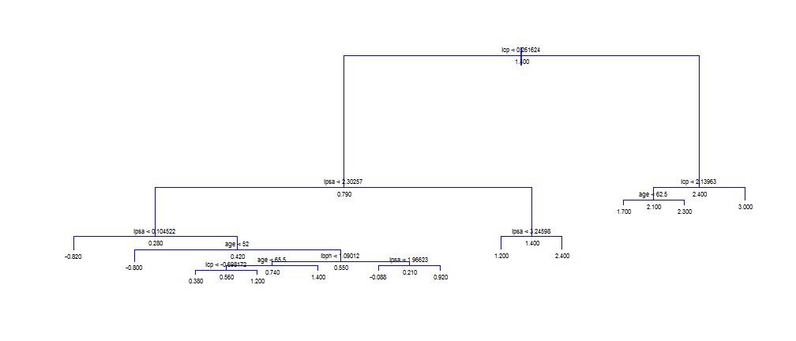

---
title       : Decision Trees example
subtitle    : Working with the Prostate cancer dataset
author      : Maria Bravo (based on material shown in "Data Mining and Business Analytics with R" Ledolter(2013))
logo        : datascience.png
job         : 
framework   : io2012        # {io2012, html5slides, shower, dzslides, ...}
highlighter : highlight.js  # {highlight.js, prettify, highlight}
hitheme     : tomorrow      # 
widgets     : []            # {mathjax, quiz, bootstrap}
mode        : selfcontained # {standalone, draft}
knit        : slidify::knit2slides

--- dt:10
## Prediction using a prostate cancer dataset
### Decision trees
- Use a tree-logic to make predictions. We talk about classification trees if the response is categorical; we talk about regression trees if the response is continuous.
- Regression trees try to predict a (numeric) mean response at the leaves of the tree, such as the expected amount of rain in inches, or the expected default rate on loans.

### The prostate cancer dataset
- The data, taken from Stamey et al. (1989), contains the results of biopsies on 97 men of various ages.The biopsy information includes:
  - Gleason score (gleason): in this data set, the range is from 6 to 9.
  - Prostate-specific antigen (psa): laboratory results on protein production.
  - Capsular penetration (cp): reach of cancer into the gland lining.
  - Benign prostatic hyperplasia amount (bph): size of the prostate.

--- .class #id 

## The application
<p style="font-size:18px">
This application predicts the prostate cancer tumor logarithm volume (lcavol) using five covariates (age, log of bph, log of cp, log of psa, the Gleason score) and the regression tree method. The values of lbph, lcp and lpsa must be entered as logarithms. The logarithm volume value for the tumor is displayed in cubic centimeters.
</p>


--- .class #id 

## Explaining the prediction model


```r
prostate <- read.csv("prostate.csv")
library(tree)
pstree <- tree(lcavol ~ ., data = prostate, mincut = 1)
```


- We obtain a tree with 12 leaf nodes, the graph shows the nodes and how they are split. 

- Take a patient, 65 years old and with lcp = 2. What is his prediction of log tumor size? Looking at the splits on the tree, you go right on the first split (lcp > 0.261624), left on the second split (lcp < 2.13963), and right on the third split (age > 62.5): the model predicts 2.30 for his log volume.

--- .class #id 

## The regression tree


```r
plot(pstree, col = 12, cex = 2)
text(pstree, digits = 2, cex = 0.7, all = TRUE)
```

 

